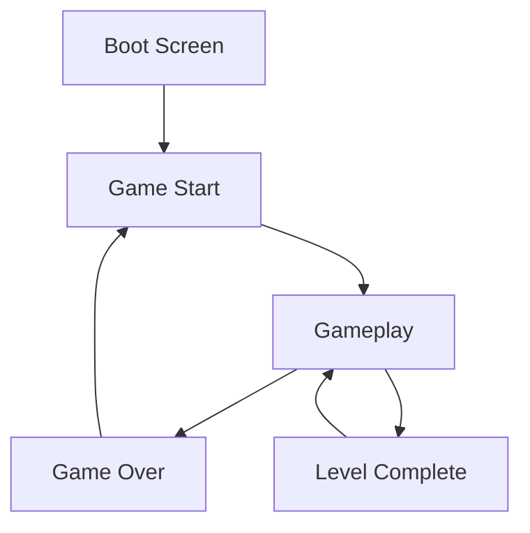
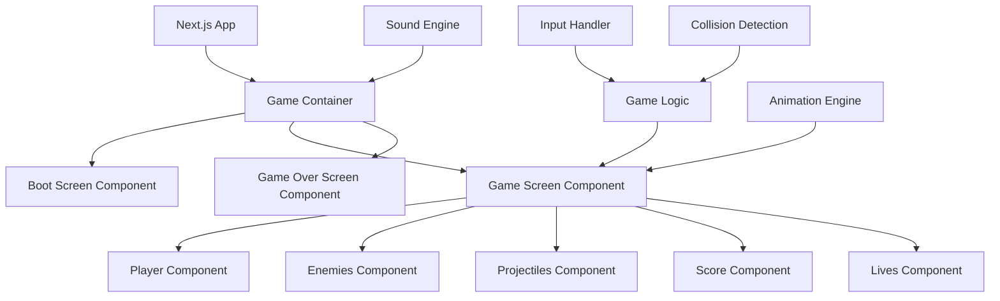

# Valaxy: A Vampire Underworld Arcade Game Plan

This document outlines the plan for building "Valaxy," an authentic 80s-style arcade game with a Vampire Underworld theme inspired by Galaga.

## Game Concept Overview

Valaxy will be a Galaga-inspired arcade shooter where the player controls a vampire hunter's ship battling against waves of vampire-themed enemies in space. The game will maintain the core mechanics of Galaga while incorporating vampire themes, pixelated graphics, and authentic arcade sounds.

## Visual Design



### Color Palette
- Primary background: Deep space black (#000000)
- Accent colors: Blood red (#990000), Vampire purple (#660066), Moonlight blue (#3333CC)
- UI elements: Blood red (#FF0000) for important text, Bone white (#EEEEEE) for standard text

### Game Elements
1. **Player Ship**: A vampire hunter's crossbow-shaped ship
2. **Enemies**: 
   - Basic vampires (replacing Galaga's basic enemies)
   - Bat formations (replacing Galaga's butterfly enemies)
   - Blood-sucking bosses (replacing Galaga's flagship enemies)
3. **Projectiles**: 
   - Player: Silver stakes/bolts
   - Enemies: Blood droplets

## Technical Architecture



## Core Components

1. **Game Engine**
   - Canvas-based rendering for pixel-perfect graphics
   - Game loop with requestAnimationFrame
   - State management for game progression

2. **Boot Screen**
   - "Valaxy" logo in pixelated gothic font
   - Single player mode (no 2P option as requested)
   - High score display
   - "West Coast AI Labs" copyright
   - Authentic boot-up sequence with scan lines and CRT effects

3. **Player Controls**
   - Keyboard controls (left/right arrows for movement, space for firing)
   - Optional touch controls for mobile
   - Responsive design for different screen sizes

4. **Enemy AI**
   - Formation patterns similar to Galaga
   - Diving attacks toward the player
   - Special vampire abilities (transforming, capturing player ship)

5. **Scoring System**
   - Points for different enemy types
   - Bonus points for complete formations
   - High score persistence

6. **Sound Design with Tone.js**
   - 8-bit style sound effects
   - Background music with vampire theme
   - Game event sounds (shooting, explosions, enemy movements)

7. **Vampire-Themed Features**
   - Blood moon phases affecting gameplay
   - Garlic power-ups for area attacks
   - Holy water shields
   - Vampire hypnosis (similar to Galaga's tractor beam)

## Implementation Plan

### Phase 1: Project Setup
1. Set up the Next.js project structure
2. Install necessary dependencies:
   - Tone.js for sound
   - A canvas library or use native Canvas API
   - State management (if needed beyond React)

### Phase 2: Core Game Engine
1. Implement the game loop
2. Create the rendering system
3. Set up collision detection
4. Implement basic player movement and shooting

### Phase 3: Enemy System
1. Create enemy types and formations
2. Implement enemy movement patterns
3. Add enemy attacks and special abilities

### Phase 4: UI and Screens
1. Design and implement the boot screen
2. Create the game UI (score, lives, level)
3. Implement game over and level complete screens

### Phase 5: Sound and Polish
1. Integrate Tone.js for sound effects and music
2. Add screen effects (CRT, scan lines)
3. Implement particle effects for explosions
4. Add game feel enhancements (screen shake, flash effects)

### Phase 6: Testing and Optimization
1. Test on different devices and browsers
2. Optimize performance
3. Add final polish and bug fixes

## File Structure

```
/app
  /components
    /game
      BootScreen.tsx
      GameScreen.tsx
      GameOverScreen.tsx
      Player.tsx
      Enemy.tsx
      Projectile.tsx
      UI.tsx
  /game
    /engine
      gameLoop.ts
      renderer.ts
      collision.ts
      input.ts
    /entities
      player.ts
      enemies.ts
      projectiles.ts
    /sounds
      soundEngine.ts
      effects.ts
      music.ts
    /utils
      spriteLoader.ts
      animationEngine.ts
    gameState.ts
  /public
    /assets
      /sprites
        player.png
        enemies.png
        projectiles.png
        explosions.png
      /sounds
        shoot.mp3
        explosion.mp3
        background.mp3
  page.tsx (main game container)
```

## Dependencies to Add
- Tone.js for sound generation and management
- Possibly PixiJS or Phaser for more advanced game features (optional)

## Vampire Underworld Theme Integration

To fully embrace the Vampire Underworld theme, we'll incorporate:

1. **Narrative Elements**:
   - Brief intro text about vampire invasion from space
   - Level transitions with vampire lore

2. **Visual Theming**:
   - Gothic-inspired UI elements
   - Blood splatter effects
   - Moonlit space background

3. **Gameplay Mechanics**:
   - Day/night cycle affecting vampire strength
   - Special weapons effective against specific vampire types
   - Boss vampires that can capture and convert your ship (similar to Galaga's tractor beam)

## Authentic Arcade Experience

To ensure an authentic arcade feel:

1. **CRT Effects**:
   - Scan lines
   - Screen curvature
   - Pixel glow

2. **Cabinet Simulation**:
   - Optional arcade cabinet frame
   - Coin insert animation
   - Authentic boot sequence

3. **Controls**:
   - Simple, responsive controls
   - Optional virtual joystick for mobile